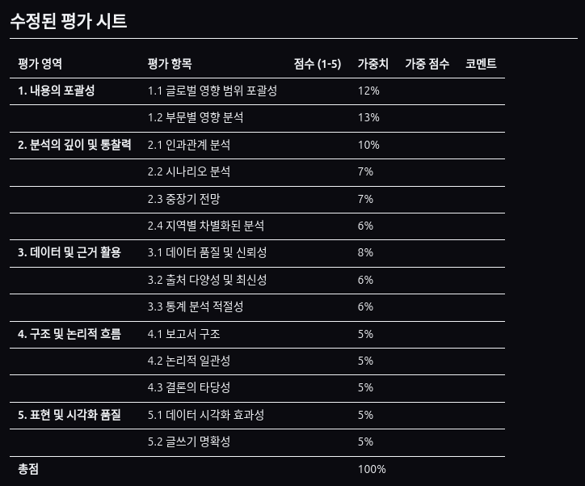

<!--class: invert -->

# AI Tool 101

> David Lee @ AI성장전략본부

## Table of Content

- Basic
  - Deep Research
  - NotebookLM
- Advanced
  - Canvas (Artifact)
  - Deeper Research
- (선택) Cursor 활용

## Basic - Deep Research (1)

- Web 검색을 활용 정보의 Retrieval과 자율적 계획과 추론에 따라 주제에 대한 연구를 수행
- Grok 무료 옵션 (Rate Limit) / Perplexity Pro


## Basic - Deep Research (2)

- "Trump 정부 관세 정책의 Global 경제 영향 심층 분석"에 대한 결과


## Basic - NotebookLM

- Audio Learner를 위한 선택지
- Google의 NotebookLM (무료)
  > 관심 주제 Deep Research > NotebookLM > 출퇴근 Podcast


## Advanced </br>- Canvas (Artifact)

- [복잡한 개념 이해 (애니메이션)](https://claude.site/artifacts/b2cd28f2-8520-457f-9641-5b032f3d6d7e)
- PPT 보고서 시각화 (혹은 장표 대체)
- 시각화 > React 생성 > 검토 및 수정 > SVG로 추출
- `Publish` 활용 / Draft 공동 리뷰


## Advanced </br>- Deeper Research

<style scoped>
p {
   font-size:16px;
}
</style>

- Deep Research의 결과가 만족스럽지 않을 경우
- Prompt 증강 기법을 활용
  - Research Assistant를 위한 Guide 생성
    > 트럼프 관세 정책이 Global 경제에 미칠 영향이라는 주제로 심층 연구를 Research Firm에 의뢰하려고 합니다. 심도있고 포괄적인 연구가되도록 상세한 요청서를 작성해주세요
  - 생성된 Guide 활용 Deep Research 수행


## Cursor

- **Vibe Working**을 추구하는 구성원
- Learning Curve 존재

### Why

- 다수의 파일을 AI에 Feed/재사용 용이
- 다양한 서식 지원
  - Markdown / Mermaid / Marp ...
- MCP를 통한 다양한 툴 활용
- 반복 업무의 Program화 `AI 코딩 활용`


## Cursor Demo</br>- Trump 관세 영향 보고서 평가하기 (1)

- 평가 Template 사용
- 리포트에 대한 상세 평가 작성



## Cursor Demo</br>- Trump 관세 영향 보고서 평가하기 (2)

- Template을 활용 평가하여 결과를 저장하도록 명령


## Cursor Demo</br>- 보고서 평가하기 (3)

- Feel the `Vibe`


## Cursor Demo</br>- 보고서 평가 (4)

- (Coding) 결과를 CSV로 추출하기 위한 프로그램 만들기
- (Coding) 추출된 CSV를 시각화 하기 위한 프로그램 만들기


## Cursor Demo</br>- 보고서 평가 (5)

> 결과 확인


## Wrap-Up

### Programming => 자연어

- 시각의 전환 필요

  > 나는 못해. 개발자들이나 하는거야..

- 창의성과 탐색의 노력
  > AI 툴 활용 가능성 ∞

### 한계

- Hallucination

  > 최종 확인에서 사람의 역할 중요

- 금일 세션 자료 모두 [Github에 공개](https://github.com/fritzprix/ai_tool_demo)

## Thank You

## Appendix - Augmented Query

```text
# 트럼프 관세 정책의 글로벌 경제 영향 연구 의뢰서

## 연구 배경 및 목적

도널드 트럼프 대통령의 재선으로 인해 새로운 관세 정책이 예상되는 상황에서, 이러한 정책이 글로벌 경제와 시장에 미칠 잠재적 영향에 대한 포괄적인 이해가 필요합니다. 본 연구는 트럼프 행정부의 관세 정책을 분석하고, 이에 대한 글로벌 경제의 반응과 장단기적 영향을 평가하는 것을 목적으로 합니다.

## 연구 범위

### 1. 정책 분석
- 트럼프 행정부의 기존 관세 정책(2017-2021) 검토 및 평가
- 현재 제안된 새로운 관세 정책의 세부 내용 분석
- 관세 정책 시행의 법적, 제도적 메커니즘 분석
- 주요 목표 대상국가(중국, EU, 멕시코, 캐나다 등) 및 산업 분석

### 2. 경제적 영향 평가
- 글로벌 무역 흐름과 패턴 변화 예측
- 주요 산업별 영향 분석(자동차, 전자, 철강, 농업 등)
- 글로벌 공급망 재편 가능성 및 영향
- 인플레이션, 물가, 고용 등 거시경제 지표에 미치는 영향
- 주요 국가별 GDP 성장률 및 경제지표 영향 전망

### 3. 금융 시장 영향
- 주식, 채권, 외환 시장 반응 예측
- 금융 안정성에 대한 잠재적 위험 평가
- 투자 흐름 변화 및 FDI(외국인직접투자) 패턴 분석

### 4. 정책 대응 시나리오
- 주요 무역 상대국들의 잠재적 대응 조치 분석
- 다양한 관세 시나리오에 따른 경제적 결과 시뮬레이션
- 상호 보복 관세의 잠재적 에스컬레이션 경로 및 영향

### 5. 산업별 및 지역별 세부 분석
- 한국 경제에 미치는 특별 영향 분석
- 아시아, 유럽, 북미, 남미 지역별 차별화된 영향
- 산업별 취약성 및 기회 평가

## 연구 방법론

1. **정량적 분석**
   - 계량경제학적 모델링 및 시뮬레이션
   - 무역 데이터 및 경제지표 기반 통계 분석
   - 산업연관분석을 통한 파급효과 추정

2. **정성적 분석**
   - 정책 전문가, 경제학자, 산업 리더 인터뷰
   - 과거 유사 정책 사례 분석
   - 기업 및 정부 반응 패턴 분석

3. **시나리오 분석**
   - 주요 변수에 따른 다중 시나리오 개발
   - 최악/최선/가능성 높은 시나리오별 영향 평가
   - 시간대별 경제 영향 변화 추적(단기/중기/장기)

## 기대 산출물

1. **종합 보고서**
   - 주요 연구 결과 및 정책 함의를 담은 포괄적 분석 보고서
   - 데이터 기반 인사이트 및 전략적 시사점 제공

2. **시각화 자료**
   - 핵심 데이터 및 예측 결과를 보여주는 대시보드
   - 정책-영향 관계 시각화 자료
   - 산업 및 지역별 영향 히트맵

3. **정책 브리핑**
   - 주요 이해관계자를 위한 요약 보고서
   - 정책 결정자 및 기업 전략가를 위한 실행 가능한 인사이트

4. **분기별 업데이트**
   - 정책 변화 및 실제 경제 영향에 따른 분기별 업데이트 보고서
   - 예측과 실제 결과 비교 분석

## 연구 일정

- **1단계**: 초기 정책 분석 및 연구 프레임워크 구축 (4주)
- **2단계**: 경제적 영향 모델링 및 데이터 분석 (8주)
- **3단계**: 시나리오 개발 및 테스트 (6주)
- **4단계**: 최종 보고서 작성 및 결과 시각화 (4주)

## 연구팀 요구사항

- 국제 무역 정책 전문가
- 거시경제 모델링 전문가
- 산업별 분석가(자동차, 전자, 철강, 농업 등)
- 데이터 사이언티스트 및 계량경제학자
- 정책 분석가 및 지정학적 리스크 전문가
- 지역별 전문가(아시아, 유럽, 북미, 남미)

## 기타 요구사항

- 모든 데이터 소스는 투명하게 공개되어야 함
- 분석의 가정과 한계점을 명확히 기술
- 연구 결과의 주기적 업데이트 및 정책 변화에 따른 수정 계획 포함
- 최종 보고서는 한국어와 영어로 제공
- 경영진을 위한 요약 및 기술적 부록 모두 포함

이 연구를 통해 트럼프 관세 정책의 글로벌 경제 영향에 대한 심층적 이해를 바탕으로, 기업과 정부의 전략적 의사결정을 지원하고자 합니다.
```

## Appendix - Claude Artifact 활용 예시

- [프롬프트 시나리오별 가격 시뮬레이션](https://claude.site/artifacts/215fdcb0-ba18-4c74-9676-a063443aa046)
- [DCF Valuation 계산기](https://claude.site/artifacts/de784749-bc58-4bd9-9df9-e229fdac6372)
- [MCP 시각화](https://claude.site/artifacts/baaf6080-bcf2-428c-8598-0cef913156dc)
- [Tetris 게임](https://claude.site/artifacts/d1c53afa-b634-4518-9e98-ea99871a6dea)
