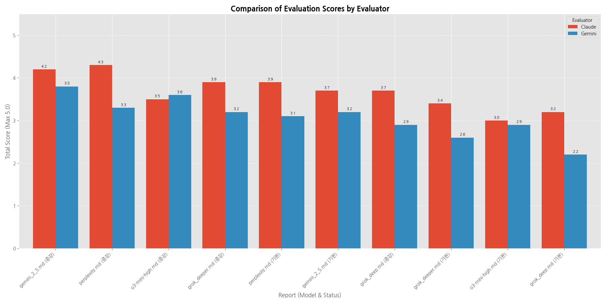

<!--class: invert -->

# AI Tool 101

> David Lee @ AI성장전략본부

## |


## Table of Content

- Basic
  - Deep Research
  - 범용 Web AI Agent
  - NotebookLM
- Advanced
  - Canvas (Artifact)
  - Deeper Research
- (선택) Cursor 활용

## Deep Research (1)

- Web 검색을 활용 정보의 Retrieval과 자율적 계획과 추론에 따라 주제에 대한 연구를 수행
- Grok 무료 옵션 (Rate Limit) / Perplexity Pro


## Deep Research (2)

- "Trump 정부 관세 정책의 Global 경제 영향 심층 분석"에 대한 결과
  > Gemini-2.5 Pro / Grok /</br>o3-mini / Perplexity


## 범용 Web AI Agent

- OpenAI의 Operator가 대표적 (Plus 구독)
- 무료 대안 Convergence.ai에서 Proxy
  - Operator와 유사
  - Memory 기능을 통해 Agent가 실패하는 지점에서 사용자가 지도 가능(이를 기억)
  - Orchestrator와 Proxy 다중 Agent 구조

## Proxy (1)


- 강점
  - 무료로 사용할 수 있으며 비용이 월$20로 저렴
  - Template을 통해 작업을 재사용 가능한 형태로 만들고 공유 가능
  - Automation을 등록, 주기적으로 해당 Task를 수행, 결과를 메일 등으로..
- 한계
  - Captcha
  - 세션 정보 공유 등

## Proxy (2)

- 활용 예시
  - 스타트업 서치
  - 신규 트렌딩 기술 및 논문 서치
  - ...


## NotebookLM

- Audio Learner를 위한 선택지
- Google의 NotebookLM (무료)
  > 관심 주제 Deep Research > NotebookLM > 출퇴근 Podcast

<audio controls>
  <source src="./res/nb_lm.mp3" type="audio/mpeg">
  Your browser does not support the audio element.
</audio>


## Canvas (Artifact)

- Claude / Gemini / ChatGPT 등 유사한 기능
- 코드 (Javascript)를 실행 시킬 수 있는 환경
- 간단한 웹 게임이나 시각화 / 시뮬레이션 등 가능

## Canvas (Artifact) - PPT 활용 하기(1)

<style scoped>
  ul {
    font-size:24px;
  }
</style>

- 장표에 표현될 내용을 [파일](./idea.md)로 준비
  - 복잡한 시각화 Prompt

    ```text
    당신은 인포그래픽, 디자인 전문 컨설턴트 입니다. 임원분들께 발표할 자료를 만드는 과정입니다.

    첨부 파일을 분석해서, 시각화 자료로 만들 수 있는 요소들을 추출해 주세요.

    선형 그래프, 막대 그래프, 파이차트 등 가장 적절한 포맷을 추천해서 만들어주세요.

    16:9 PPT용 슬라이드 디자인으로 만들어 주되, React 파일로 1차 생성해 주세요.

    이후 파워포인트에서 수정이 가능하도록 SVG 버전도 추출할 예정입니다. 참고 해 주세요.

    브랜드 컬러는 연보라, 보라, 블랙, 그레이, 화이트를 깔끔하게 사용하고, 폰트는 Noto Sans CJK KR 와같은 깨끗한 고딕체를 사용 해 주세요.

    ‘전체적인 분위기는 모던하고 깨끗하게 만들어 주세요.

    ‘불필요한 텍스트나 장식은 최소화해주세요.’

    ‘슬라이드마다 차트, 그래프, 인포그래픽을 적절히 배치하고, 각 슬라이드에 숫자나 통계가 한눈에 들어오도록 간결하게 구성해 주세요.’

    만약 오류가 뜨면, 그 오류를 자동 분석한 후, 자동 수정까지 해주세요.
    ```
  
  - 간결한 시각화 Prompt

    ```text
    첨부 파일을 React를 활용하여 시각화 해주세요.
    - 사용자, AI Agent, 3rd Party의 관계, 거래의 흐름
    - 사용자 규모의 확장에 의한 선순환 개념과 기회 중심
    ```

  - React : 요소들간의 보다 안정적인 layout을 보장


## Canvas (Artifact) - PPT 활용 하기(1-1)

- 결과 비교
  - [복잡한 Prompt](https://claude.site/artifacts/88ee3c53-2811-4352-82a0-35b3bc5cfecf)
  - [간결한 Prompt](https://claude.site/artifacts/fcd13af0-7f5f-49ee-a462-3818abefa211)

- 시각화 결과물의 수정
  - 해당 시각화 스크린샷
  - Image Prompt와 함께 문제점 분석을 지시

    ```text
    시각화에 문제가 있습니다. 이미지를 정밀하게 살펴보고 원인을 차근차근 분석해주세요
    ```

- [최종 결과](https://claude.site/artifacts/f383c5c2-6448-4f81-84cf-7b3d534539ad)
- React 결과물이 가장 완성도 높은 Visual (이미지 스샷 활용)

## Canvas (Artifact) - PPT 활용 하기(2)

- 결과물의 레이아웃 등이 만족스럽지 않거나 PPT에 넣어 직접 수정을 원할 경우
- SVG로 변환하기
  
  ```prompt
  위 시각화를 각각 SVG로 만들어주세요.
  ```


## Canvas (Artifact) - PPT 활용 하기(3)

- SVG결과를 다운로드 후 PPT에 삽입
- 그룹 해제 후 편집


## Canvas (Artifact) - 기타

- [복잡한 개념 이해 (애니메이션)](https://claude.site/artifacts/b2cd28f2-8520-457f-9641-5b032f3d6d7e)
- [토큰 비용 시뮬레이션](https://claude.site/artifacts/215fdcb0-ba18-4c74-9676-a063443aa046)


## Deeper Research </br>- Query Augmentation (1)

<style scoped>
p {
   font-size:16px;
}
</style>

- Deep Research의 결과가 만족스럽지 않을 경우
- Prompt 증강 기법을 활용
  - AI를 활용 Research Assistant를 위한 Guide 생성
    > 트럼프 관세 정책이 Global 경제에 미칠 영향이라는 주제로 심층 연구를 Research Firm에 의뢰하려고 합니다. 심도있고 포괄적인 연구가되도록 상세한 요청서를 작성해주세요
  - 증강된 Prompt 활용 Deep Research 수행

## Deeper Research </br>- Query Augmentation (2)

```text
# 트럼프 관세 정책의 글로벌 경제 영향 연구 의뢰서

## 연구 배경 및 목적

도널드 트럼프 대통령의 재선으로 인해 새로운 관세 정책이 예상되는 상황에서, 이러한 정책이 글로벌 경제와 시장에 미칠 잠재적 영향에 대한 포괄적인 이해가 필요합니다. 본 연구는 트럼프 행정부의 관세 정책을 분석하고, 이에 대한 글로벌 경제의 반응과 장단기적 영향을 평가하는 것을 목적으로 합니다.

## 연구 범위

### 1. 정책 분석
- 트럼프 행정부의 기존 관세 정책(2017-2021) 검토 및 평가
- 현재 제안된 새로운 관세 정책의 세부 내용 분석
- 관세 정책 시행의 법적, 제도적 메커니즘 분석
- 주요 목표 대상국가(중국, EU, 멕시코, 캐나다 등) 및 산업 분석

### 2. 경제적 영향 평가
- 글로벌 무역 흐름과 패턴 변화 예측
- 주요 산업별 영향 분석(자동차, 전자, 철강, 농업 등)
- 글로벌 공급망 재편 가능성 및 영향
- 인플레이션, 물가, 고용 등 거시경제 지표에 미치는 영향
- 주요 국가별 GDP 성장률 및 경제지표 영향 전망


### 3. 금융 시장 영향
- 주식, 채권, 외환 시장 반응 예측
- 금융 안정성에 대한 잠재적 위험 평가
- 투자 흐름 변화 및 FDI(외국인직접투자) 패턴 분석

### 4. 정책 대응 시나리오
- 주요 무역 상대국들의 잠재적 대응 조치 분석
- 다양한 관세 시나리오에 따른 경제적 결과 시뮬레이션
- 상호 보복 관세의 잠재적 에스컬레이션 경로 및 영향

### 5. 산업별 및 지역별 세부 분석
- 한국 경제에 미치는 특별 영향 분석
- 아시아, 유럽, 북미, 남미 지역별 차별화된 영향
- 산업별 취약성 및 기회 평가

## 연구 방법론

1. **정량적 분석**
   - 계량경제학적 모델링 및 시뮬레이션
   - 무역 데이터 및 경제지표 기반 통계 분석
   - 산업연관분석을 통한 파급효과 추정

2. **정성적 분석**
   - 정책 전문가, 경제학자, 산업 리더 인터뷰
   - 과거 유사 정책 사례 분석
   - 기업 및 정부 반응 패턴 분석

3. **시나리오 분석**
   - 주요 변수에 따른 다중 시나리오 개발
   - 최악/최선/가능성 높은 시나리오별 영향 평가
   - 시간대별 경제 영향 변화 추적(단기/중기/장기)

## 기대 산출물

1. **종합 보고서**
   - 주요 연구 결과 및 정책 함의를 담은 포괄적 분석 보고서
   - 데이터 기반 인사이트 및 전략적 시사점 제공

2. **시각화 자료**
   - 핵심 데이터 및 예측 결과를 보여주는 대시보드
   - 정책-영향 관계 시각화 자료
   - 산업 및 지역별 영향 히트맵

3. **정책 브리핑**
   - 주요 이해관계자를 위한 요약 보고서
   - 정책 결정자 및 기업 전략가를 위한 실행 가능한 인사이트

4. **분기별 업데이트**
   - 정책 변화 및 실제 경제 영향에 따른 분기별 업데이트 보고서
   - 예측과 실제 결과 비교 분석

```


## Cursor (+Markdown)

- **Vibe Working**을 추구하는 구성원
- Learning Curve 존재

### Why

- 다수의 파일을 AI에 Feed/재사용 용이
- Markdown의 다양한 서식 지원
  - Markdown / Mermaid / Marp ...
- MCP를 통한 다양한 툴 활용
- 반복 업무의 Program화 `AI 코딩 활용` / Template화


## Markdown

- 간략한 서식을 지원하는 마크업
- LLM 학습 시 코드 데이터 중 많은 부분 차지
- 따라서 AI가 잘 이해하고 (구조)
- Prompting 활용하기 좋음


## Cursor Demo</br>- Trump 관세 영향 보고서 평가하기 (1)

- 평가 Guide를 생성(Claude) 후 Markdown으로 저장

  ```markdown
  연구 보고서의 품질을 평가하기 위한 Guide 제안
  ```

- 해당 Guide를 입력으로 평가 Template을 생성 (Cursor)
- 리포트에 대한 상세 평가 작성 (Cursor)


## Cursor Demo</br>- Trump 관세 영향 보고서 평가하기 (2)

- Template을 활용 평가하여 결과를 저장하도록 명령


## Cursor Demo</br>- 보고서 평가하기 (3)

- Feel the `Vibe`
- 하지만.. 한번에 성공하지 않을 수 있음, 재시도의 용이성이 핵심


## Cursor Demo</br>- 보고서 평가 (4)

- (Coding) 결과를 CSV로 추출하기 위한 프로그램 만들기
- (Coding) 추출된 CSV를 시각화 하기 위한 프로그램 만들기


## Cursor Demo</br>- 보고서 평가 (5)

> 총 10개 DeepSearch 자료에 대한 주요한 Insight를 10분내 추출, 시각화



## Cursor Live Demo</br>- 보고서 취합 (6)

> 전체 보고서를 하나의 구조화된 보고서로 만들기

## Wrap-Up

- 시각의 전환 필요 (Programming => 자연어)

  > 나는 못해. 개발자들이나 하는거야..

- 창의적 게으름

  > 새로운 AI 적용 가능성을 발견

- Hallucination
  > 최종 확인에서 사람의 역할 중요

> 금일 세션 자료 모두 [Github에 공개](https://github.com/dropthekeyboard/ai_tool_demo)


## Thank You

## Appendix - Augmented Query

```text
# 트럼프 관세 정책의 글로벌 경제 영향 연구 의뢰서

## 연구 배경 및 목적

도널드 트럼프 대통령의 재선으로 인해 새로운 관세 정책이 예상되는 상황에서, 이러한 정책이 글로벌 경제와 시장에 미칠 잠재적 영향에 대한 포괄적인 이해가 필요합니다. 본 연구는 트럼프 행정부의 관세 정책을 분석하고, 이에 대한 글로벌 경제의 반응과 장단기적 영향을 평가하는 것을 목적으로 합니다.

## 연구 범위

### 1. 정책 분석
- 트럼프 행정부의 기존 관세 정책(2017-2021) 검토 및 평가
- 현재 제안된 새로운 관세 정책의 세부 내용 분석
- 관세 정책 시행의 법적, 제도적 메커니즘 분석
- 주요 목표 대상국가(중국, EU, 멕시코, 캐나다 등) 및 산업 분석

### 2. 경제적 영향 평가
- 글로벌 무역 흐름과 패턴 변화 예측
- 주요 산업별 영향 분석(자동차, 전자, 철강, 농업 등)
- 글로벌 공급망 재편 가능성 및 영향
- 인플레이션, 물가, 고용 등 거시경제 지표에 미치는 영향
- 주요 국가별 GDP 성장률 및 경제지표 영향 전망

### 3. 금융 시장 영향
- 주식, 채권, 외환 시장 반응 예측
- 금융 안정성에 대한 잠재적 위험 평가
- 투자 흐름 변화 및 FDI(외국인직접투자) 패턴 분석

### 4. 정책 대응 시나리오
- 주요 무역 상대국들의 잠재적 대응 조치 분석
- 다양한 관세 시나리오에 따른 경제적 결과 시뮬레이션
- 상호 보복 관세의 잠재적 에스컬레이션 경로 및 영향

### 5. 산업별 및 지역별 세부 분석
- 한국 경제에 미치는 특별 영향 분석
- 아시아, 유럽, 북미, 남미 지역별 차별화된 영향
- 산업별 취약성 및 기회 평가

## 연구 방법론

1. **정량적 분석**
   - 계량경제학적 모델링 및 시뮬레이션
   - 무역 데이터 및 경제지표 기반 통계 분석
   - 산업연관분석을 통한 파급효과 추정

2. **정성적 분석**
   - 정책 전문가, 경제학자, 산업 리더 인터뷰
   - 과거 유사 정책 사례 분석
   - 기업 및 정부 반응 패턴 분석

3. **시나리오 분석**
   - 주요 변수에 따른 다중 시나리오 개발
   - 최악/최선/가능성 높은 시나리오별 영향 평가
   - 시간대별 경제 영향 변화 추적(단기/중기/장기)

## 기대 산출물

1. **종합 보고서**
   - 주요 연구 결과 및 정책 함의를 담은 포괄적 분석 보고서
   - 데이터 기반 인사이트 및 전략적 시사점 제공

2. **시각화 자료**
   - 핵심 데이터 및 예측 결과를 보여주는 대시보드
   - 정책-영향 관계 시각화 자료
   - 산업 및 지역별 영향 히트맵

3. **정책 브리핑**
   - 주요 이해관계자를 위한 요약 보고서
   - 정책 결정자 및 기업 전략가를 위한 실행 가능한 인사이트

4. **분기별 업데이트**
   - 정책 변화 및 실제 경제 영향에 따른 분기별 업데이트 보고서
   - 예측과 실제 결과 비교 분석

## 연구 일정

- **1단계**: 초기 정책 분석 및 연구 프레임워크 구축 (4주)
- **2단계**: 경제적 영향 모델링 및 데이터 분석 (8주)
- **3단계**: 시나리오 개발 및 테스트 (6주)
- **4단계**: 최종 보고서 작성 및 결과 시각화 (4주)

## 연구팀 요구사항

- 국제 무역 정책 전문가
- 거시경제 모델링 전문가
- 산업별 분석가(자동차, 전자, 철강, 농업 등)
- 데이터 사이언티스트 및 계량경제학자
- 정책 분석가 및 지정학적 리스크 전문가
- 지역별 전문가(아시아, 유럽, 북미, 남미)

## 기타 요구사항

- 모든 데이터 소스는 투명하게 공개되어야 함
- 분석의 가정과 한계점을 명확히 기술
- 연구 결과의 주기적 업데이트 및 정책 변화에 따른 수정 계획 포함
- 최종 보고서는 한국어와 영어로 제공
- 경영진을 위한 요약 및 기술적 부록 모두 포함

이 연구를 통해 트럼프 관세 정책의 글로벌 경제 영향에 대한 심층적 이해를 바탕으로, 기업과 정부의 전략적 의사결정을 지원하고자 합니다.
```

## Appendix - Claude Artifact 활용 예시

- [프롬프트 시나리오별 가격 시뮬레이션](https://claude.site/artifacts/215fdcb0-ba18-4c74-9676-a063443aa046)
- [DCF Valuation 계산기](https://claude.site/artifacts/de784749-bc58-4bd9-9df9-e229fdac6372)
- [MCP 시각화](https://claude.site/artifacts/baaf6080-bcf2-428c-8598-0cef913156dc)
- [Tetris 게임](https://claude.site/artifacts/d1c53afa-b634-4518-9e98-ea99871a6dea)
